# JOBSHEET 1

## A. MENGAKSES "index.html" LANGSUNG DI WEB BROWSER

### 1. Beranda (index.html)


### 2. Daftar Buku (buku/list.html)
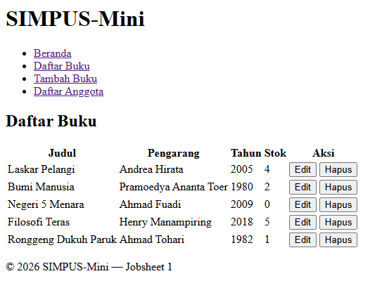

### 3. Tambah Buku (buku/tambah.html)
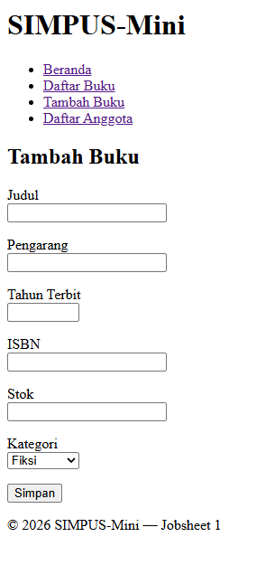

### 4. Daftar Anggota (anggota/list.html)
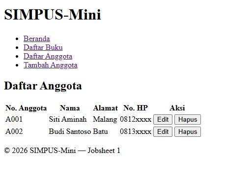

### 5. Tambah Anggota (anggota/tambah.html)
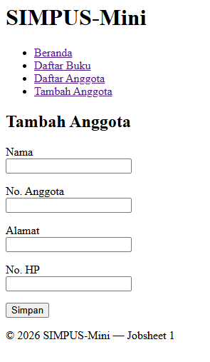

## B. BELAJAR KONSEP DASAR

### - Belajar tentang **tag** dan **elemen**.

> Tag merupakan semacam kode penanda untuk mengatur struktur file HTML yang diletakkan di awal (tag pembuka) dan akhir (tag penutup), yakni untuk setiap elemen.

Contoh penggunaan tag dan elemen :
`<h1>HALO, SEMUANYA!</h1>`

### - Belajar tentang struktur wajib HTML

```<!DOCTYPE html>                          -> tanda dokumen HTML5 ```                     
```<html lang="id">                            -> pembungkus utama, bahasa indo```
```<head>                                      -> apa yang tidak tampil di layar```
```    <meta charset="UTF-8">                  -> pengkodean karakter UTF-8```
```    <title>SIMPUS-Mini | Beranda</title>    -> judul tab browser```
```</head>```
```<body>```
```    ...```
```</body>                                     -> apa yang tampil di layar```
```</html>```

### - Belajar tentang tag semantic

> Semantic artine tag yang digunakan menjelaskan makna/perannya, bukan kotak kosong seperti `<div>`. `<div>` gak punya makna apapun, sedangkan `<header>`, `<nav>`, `<article>`, dan lain-lain memiliki makna.

### - Belajar tentang navigasi antar elemen

Intinya navigasi mirip navigasi direktori di linux. `../` untuk naik satu folder ke atas dan `/(nama file/direktori)` untuk menuju file/direktori tertentu.

## C. PERCOBAAN MODIFIKASI

### 1. Mencoba modifikasi halaman daftar buku

- Menambahkan kolom kategori pada daftar buku

Menggunakan `<th></th>` (table head) untuk menambahkan kolom baru.

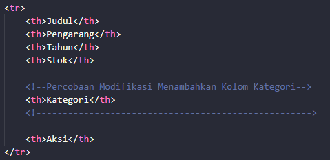

- Menambahkan buku baru di daftar buku

Menggunakan `<td></td>` (table data) untuk menambahkan data baru, juga berlaku untuk data sebelumnya untuk mengisi kolom baru (kategori).

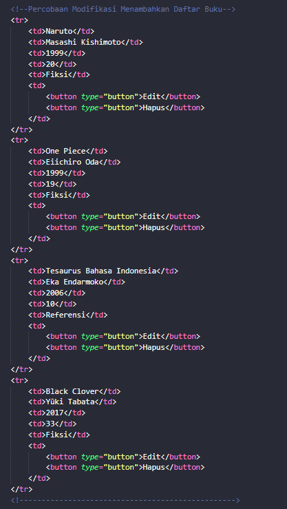

### 2. Mencoba modifikasi halaman tambah buku

- Menambahkan kolom input untuk tebal halaman buku

Menggunakan `<label></label>` yang menjadi "sahabat" dari input untuk aksesibilitas dan kenyamanan pengguna, salah satu contohnya akan dijelaskan pada bagian ```for=""```.
Kemudian, ada ```for=""``` untuk memudahkan user ketika mengarahkan kursornya pada label, maka akan menuju pada kolom input yang memuat id yang sama dengan isian ```for=""```.

`<br>` adalah line break. Ia membuat input pindah ke baris baru di bawah label (bukan sejajar di kanan label).

Terakhir, ada kolom input (`<input>`) yang akan menerima input dari user. Ada atribut `type=""` untuk menentukan tipe input, `id=""` sebagai identifier berhubungan dengan for pada label, `name=""` sebagai field yang akan dikirim ke server ketika di-submit, `min=""` sebagai minimal nilai, dan `required` yang mengartikan bahwa kolom tersebut harus diisi agar form dapat di-submit.

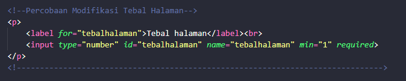

- Menambahkan kolom input untuk dimensi buku (panjang, lebar, tinggi)

Seperti biasa, menggunakan `<label></label>` dan `<input>`.

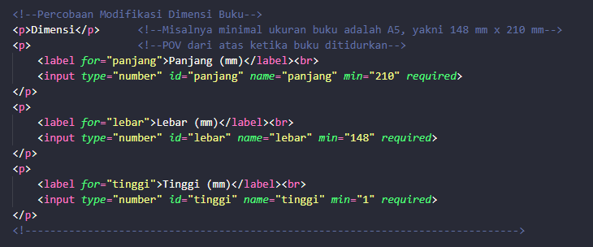

### 3. Mencoba modifikasi halaman daftar anggota

- Menambahkan kolom jenis kelamin dan jabatan

Menggunakan `<td></td>` untuk menambahkan data baru (table data).

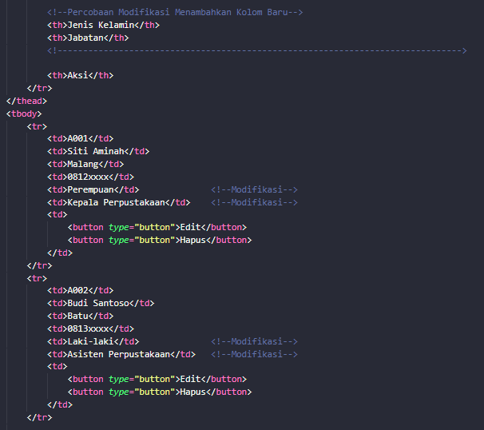

- Menambahkan data anggota baru

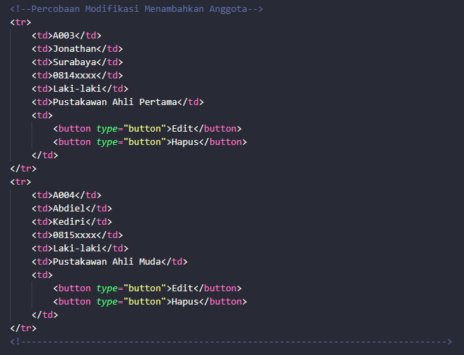

### 4. Mencoba modifikasi halaman tambah anggota

- Menambahkan kolom input jenis kelamin dan jabatan pada halaman tambah anggota

Mencoba menggunakan select untuk memilih jenis kelamin dan jabatan dengan beberapa option yang ada. 

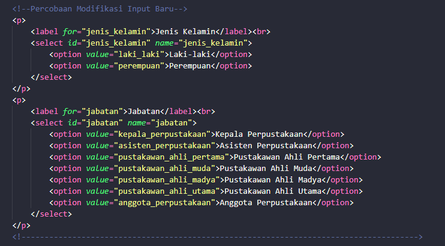

### 5. Mencoba modifikasi halaman beranda

- Menambahkan Artikel Jumlah Buku Per Kategori

Mencoba menambahkan beberapa filtering, yaitu jumlah buku berdasarkan kategorinya, hanya menggunakan beberapa tag yang sudah ada.

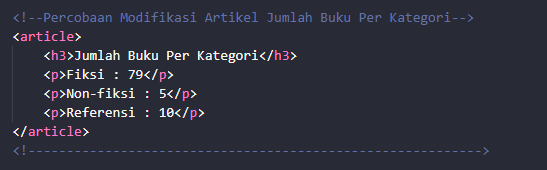

## D. JAWABAN ATAS TUGAS DAN REFLEKSI

### 1. TUGAS MANDIRI KONSISTENSI MENU NAVIGASI

Menggunakan `<li></li>` sebagai list item untuk mendaftarkan item pada list tertentu.
Menggunakan `<a></a>` sebagai hyperlink untuk menghubungkan satu halaman web ke halaman web lain dengan atribut `href=""` untuk menentukan alamat tujuan.

- Pada index.html

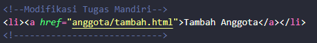

- Pada buku/list.html dan buku/tambah.html

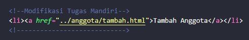

- Pada anggota/list.html dan anggota/tambah.html

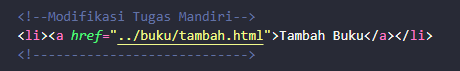

### 2. LATIHAN REFLEKTIF

#### PERTANYAAN

1. Kenapa field "Alamat" dan "No. HP" tidak diberi required, sedangkan "Nama" dan "No. Anggota" diberi?

2. Apa yang akan terjadi (di browser) kalau kamu klik tombol "Simpan" tanpa mengisi field "Nama"? Coba buka filenya di browser dan praktikkan.

3. Form ini juga belum punya action pada tag <form>-nya — apa dampaknya saat tombol "Simpan" ditekan?

#### JAWABAN

1. Menurut saya karena memang developer hanya mengharuskan kolom "Nama" dan "No. Anggota" saja untuk diisi, sedangkan kolom "Alamat" dan "No. HP" opsional, diisi boleh, tidak diisi pun boleh.

2. Sistem tidak akan memperbolehkan untuk submit hingga kolom nama terisi, karena input field ini memiliki atribut `required`.

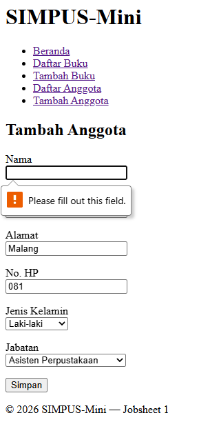

3. Tag `<form>` yang tidak memiliki atribut `action` maupun `method`, jika tombol "Simpan" ditekan, form ini belum mengirim data ke manapun (browser hanya akan reload halaman yang sama).

### 3. IDE LATIHAN TAMBAHAN

#### (Beberapa sudah dilakukan di [percobaan modifikasi](#c-percobaan-modifikasi))

4. Modifikasi email

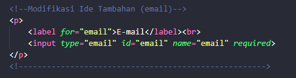

Hasil percobaan

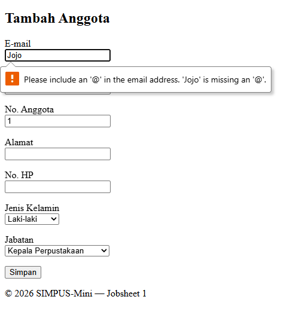


