# JOBSHEET 2

## A. MENCOBA MEMBUKA `index.html` DI BROWSER

### 1. Beranda (`index.html`)

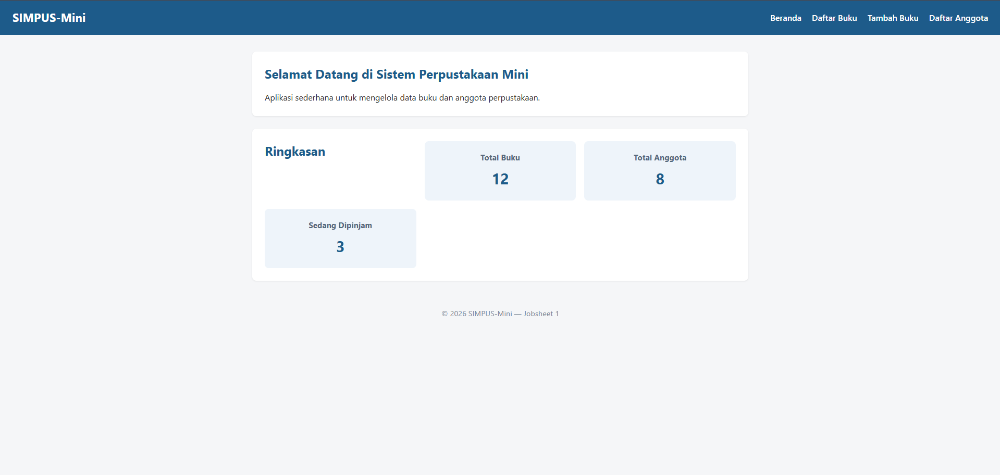

### 2. Daftar Buku

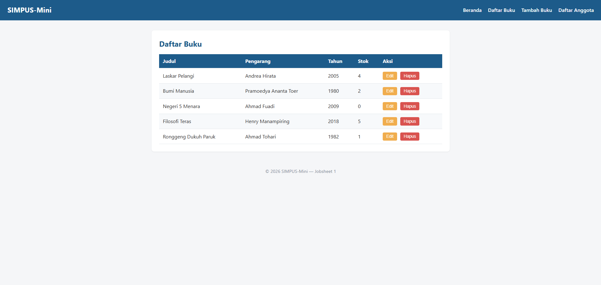

### 3. Tambah Buku

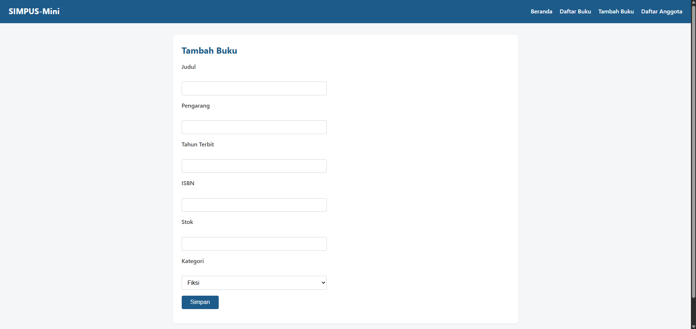

### 4. Daftar Anggota

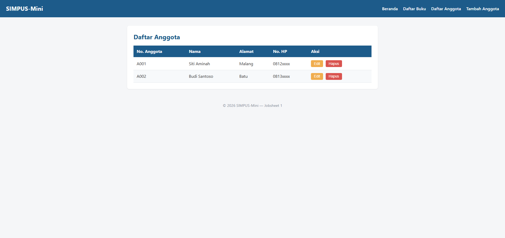

### 5. Tambah Anggota

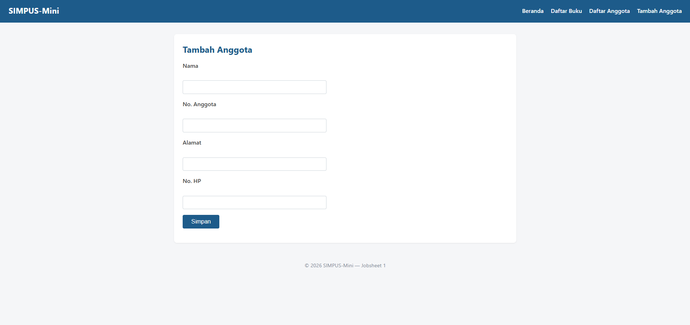

### 6. Mencoba membuka *DevTools* browser

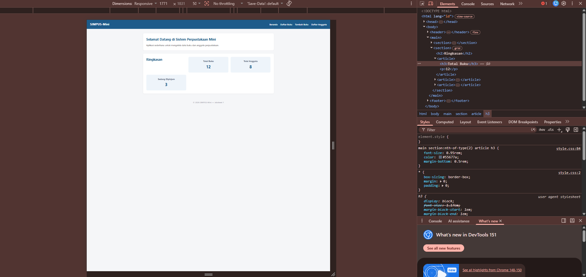

## B. MEMBANDINGKAN `index.html` PADA JOBSHEET 1 DENGAN `index.html` PADA JOBSHEET 2

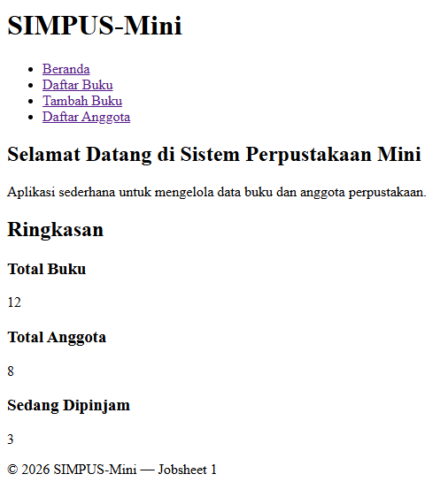

Terlihat perbedaan yang sangat besar, mulai dari warna, font, hingga peletakannya.

## C. LATIHAN TAMBAHAN

### 1. GANTI WARNA

- Mengganti warna #1d5b8a (warna biru tema) di seluruh file `style.css` dengan warna #4B0082 (indigo).

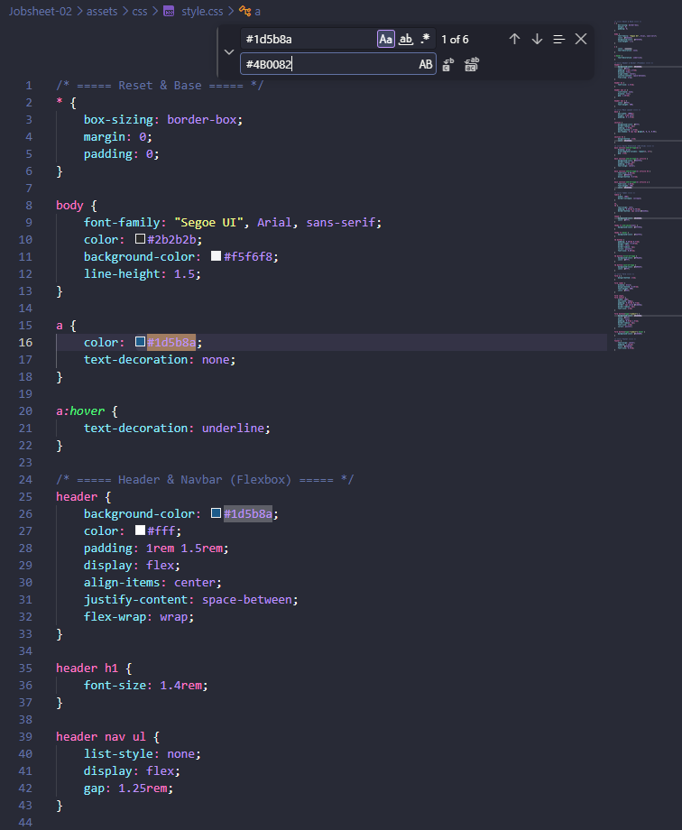

- Hasil setelah diganti :

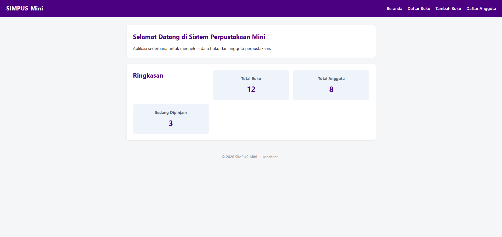

### 2. MENAMBAHKAN KOLOM KEEMPAT DI STATISTIK BERANDA

- Menambahkan article baru di `index.html`

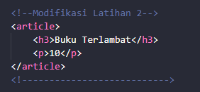

- Modifikasi `style.css`

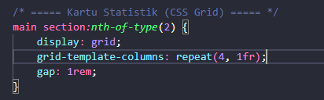

- Hasil setelah diganti :

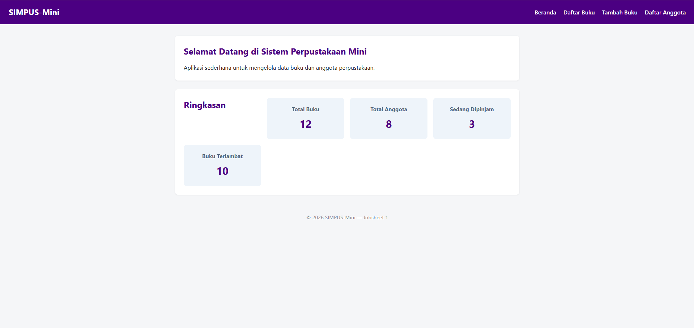

### 3. MEMBUAT TOMBOL KETIGA DI TABEL

- Menambahkan tombol "Detail" di antara "Edit" dan "Hapus"

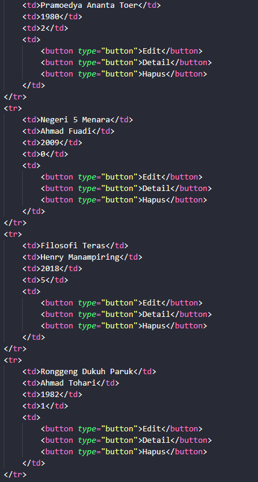

- Hasil setelah diganti :

Warna tidak sesuai, karena pewarnaan button pada `sytle.css` membedakan berdasarkan urutan tombolnya, bukan berdasarkan teks/isinya, sehingga hanya tombol pertama dan terakhir saja yang diberi warna kustom.

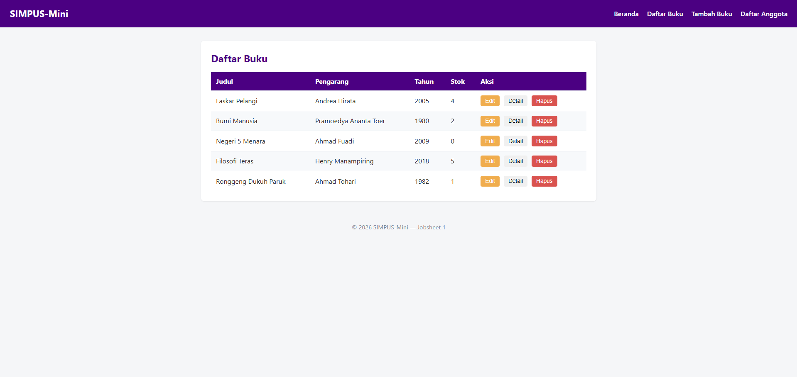

- Perbaikan dengan memberi class khusus

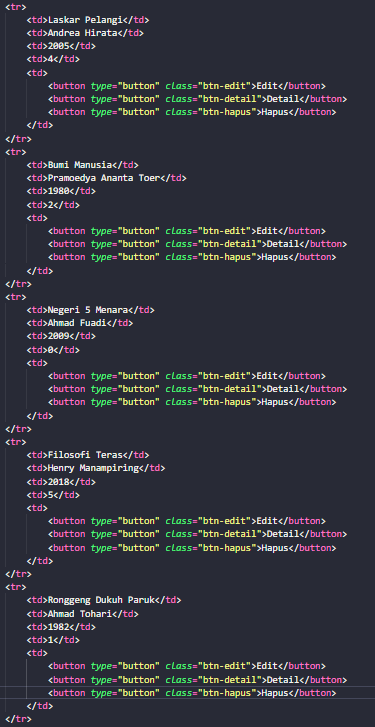

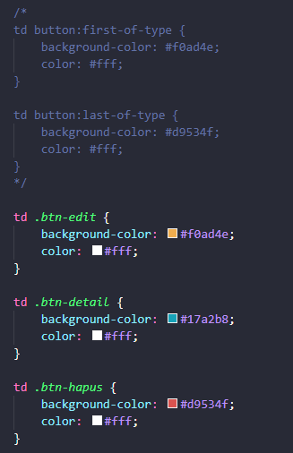

- Hasil setelah diperbaiki (final) :

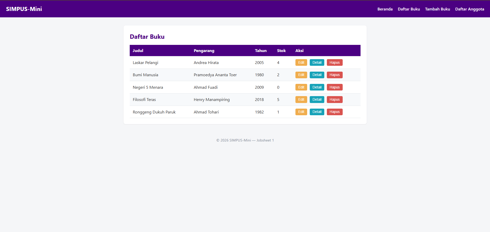

### 4. UJI RESPONSIVITAS SEDERHANA

- Tampilan awal (desktop) :

- Tampilan yang lebih sempit (menyerupai lebar layar HP) :

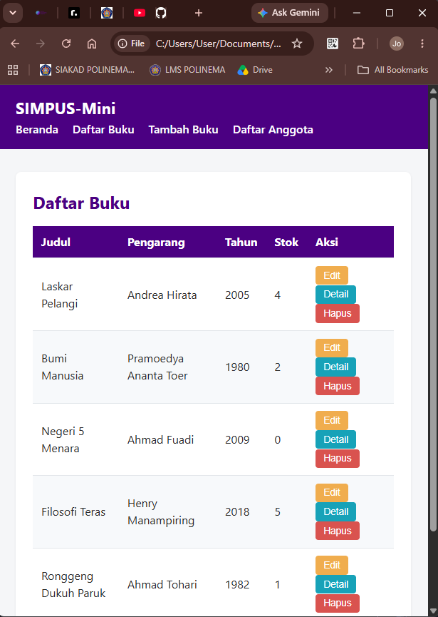

`flex-wrap: wrap` pada navbar secara otomatis mulai memindahkan daftar menu ke baris di bawah judul aplikasi pada lebar layar sekitar 615 px (menggunakan extension chrome "page ruler"). Hal ini berguna agar navigasi tetap rapi dan tidak terpotong.

