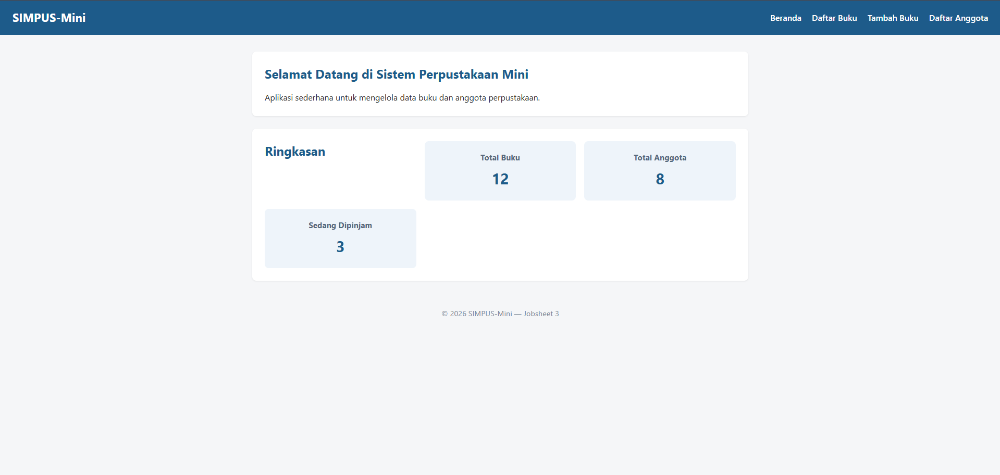
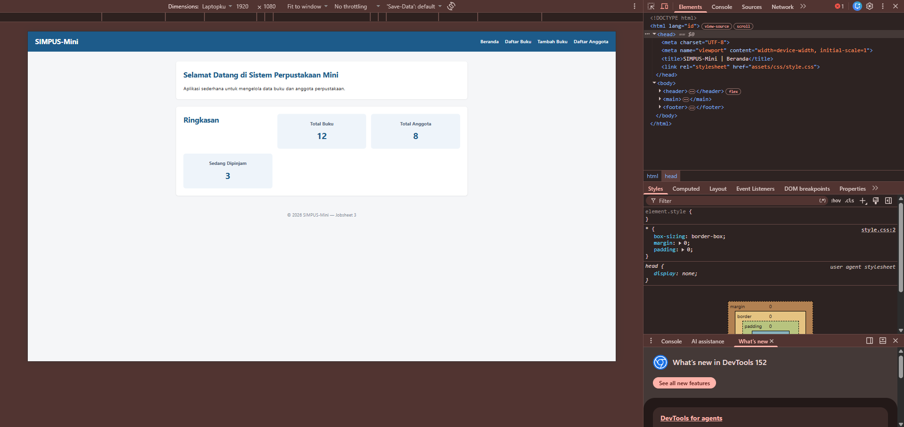
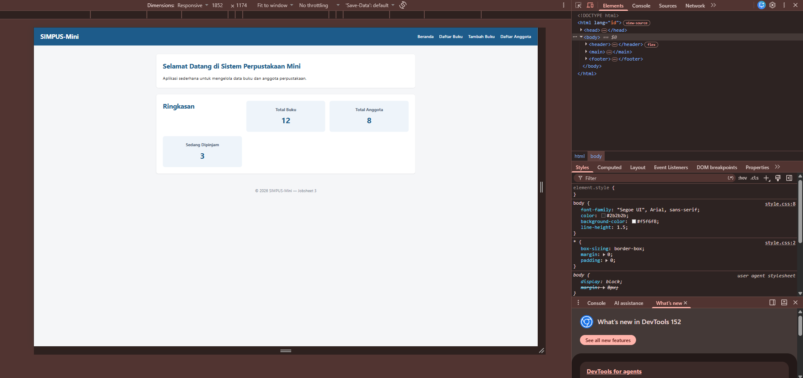
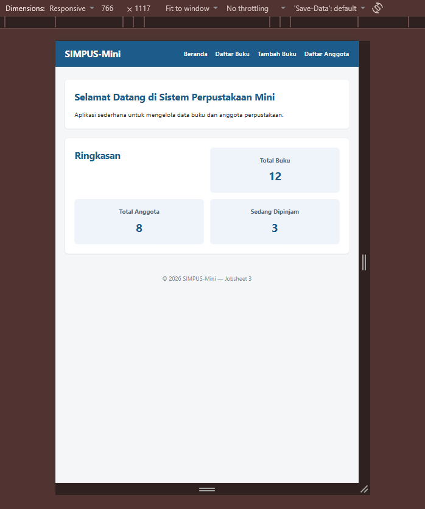
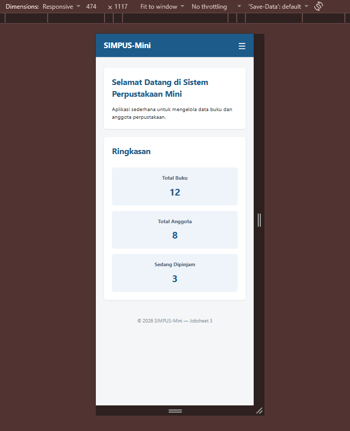
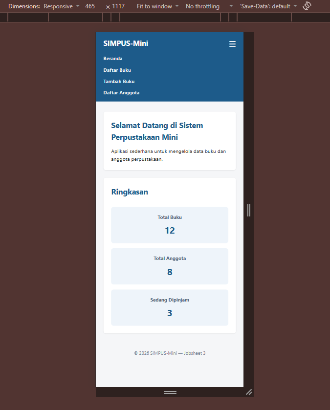
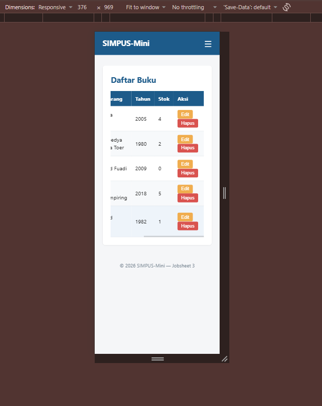

# JOBSHEET 3

## A. PENGUJIAN MANDIRI DI BROWSER

### 1. Memmbuka `index.html` di browser

### 2. Membuka *DevTools*

### 3. Mengaktifkan mode responsif

### 4. Mengubah lebar layar secara bertahap

#### - Percobaan mengubah kartu statistik

Kartu statistik berubah menjadi 2 kolom setelah melewati lebar 768px

Kartu statistik berubah menjadi 1 kolom setelah melewati lebar 480px

#### - Percobaan mengubah menu navigasi

Menu navigasi berubah menajadi logo seperti burger saat melewati lebar 480px

#### - Percobaan menu vertikal

Menu terbuka vertikal di bawah header

#### - Percobaan fitur scroll daftar buku

Tabel pada list buku menjadi responsif (bisa discroll secara horizontal)

