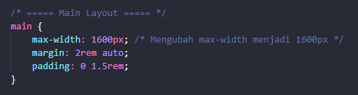
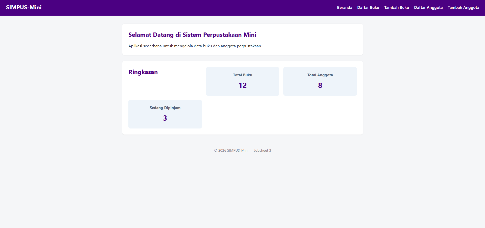
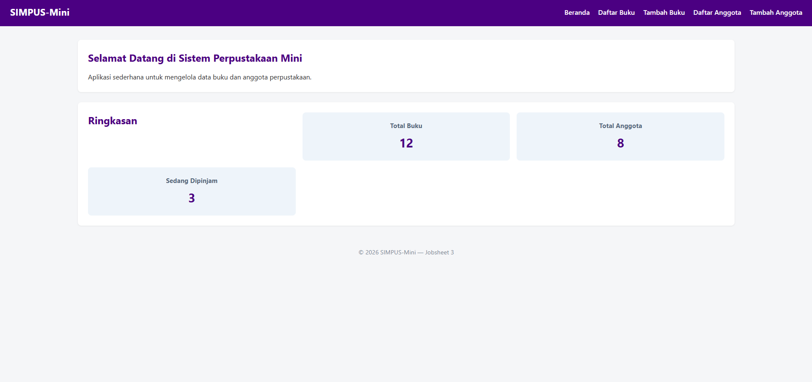
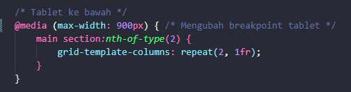
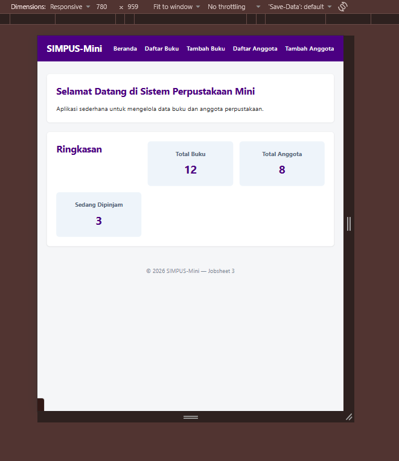
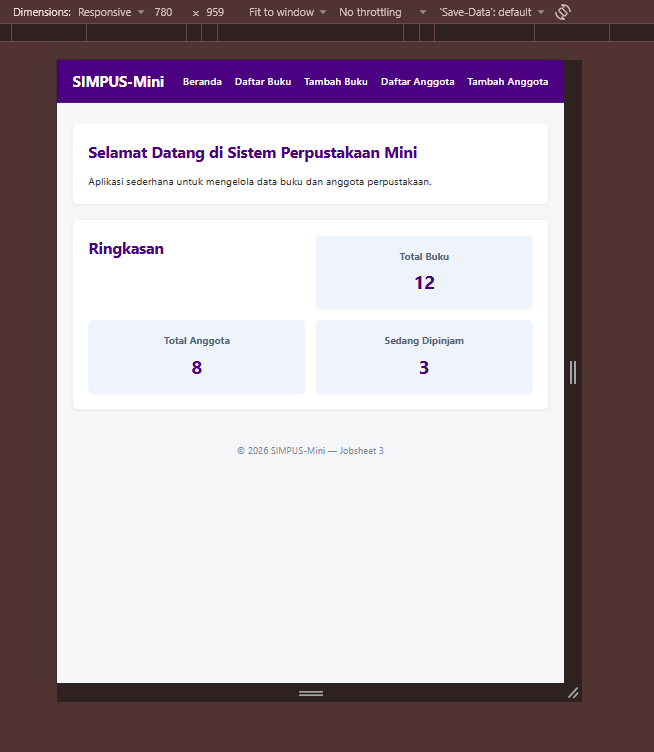
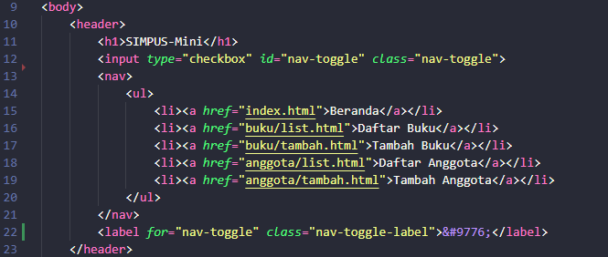
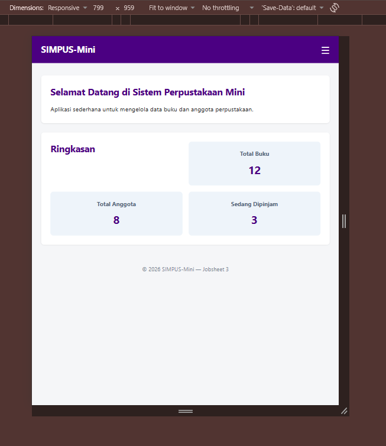

# JOBSHEET 3

## A. PENGUJIAN MANDIRI DI BROWSER

### 1. Memmbuka `index.html` di browser

### 2. Membuka *DevTools*

### 3. Mengaktifkan mode responsif

### 4. Mengubah lebar layar secara bertahap

#### - Percobaan mengubah kartu statistik

Kartu statistik berubah menjadi 2 kolom setelah melewati lebar 768px

Kartu statistik berubah menjadi 1 kolom setelah melewati lebar 480px

#### - Percobaan mengubah menu navigasi

Menu navigasi berubah menajadi logo seperti burger saat melewati lebar 480px

#### - Percobaan menu vertikal

Menu terbuka vertikal di bawah header

#### - Percobaan fitur scroll daftar buku

Tabel pada list buku menjadi responsif (bisa discroll secara horizontal)

## B. LATIHAN TAMBAHAN

### 1. Menambahkan breakpoint baru

Mengubah max-width dari 1000px menjadi 1600px

Sebelum diubah :

Setelah diubah : 

Dampaknya adalah layar utama menjadi lebih lebar dari sebelumnya, bertambah 600px lebih lebar.

### 2. Mengubah breakpoint tablet

Mengubah breakpoint tablet dari 768px menjadi 900px

Sebelum diubah : 

Setelah diubah : 

Lebar maksimal berubah dari 768px menjadi 900px. Buktinya adalah sebelum diubah, article akan menyesuaikan menjadi 2 kolom setelah melewati batas width 768 pixel. Setelah diubah, article langsung menyesuaikan menjadi 2 kolom setelah melewati batas width 900 pixel.

### 3. Menerapkan pola table-responsive ke elemen lain

### 4. Mengubah posisi ikon hamburger

Saat `.nav-toggle-label` dipindahkan ke setelah `<nav>`, CSS `.nav-toggle:checked ~ nav` masih tetap bekerja. Hal ini terjadi karena elemen sumber pencarian combinator ~ adalah `<input id="nav-toggle">` yang posisinya masih berada di sebelum `<nav>`. Fitur menu baru akan gagal/tidak bekerja apabila tag `<input class="nav-toggle">` dipindahkan ke posisi setelah `<nav>`.

### 5. Membandingkan dengan pendekatan mobile-first

Dalam pendekatan Mobile-First, CSS ditulis mulai dari tampilan layar terkecil (HP) secara default tanpa media query, lalu menggunakan @media (min-width: ...) secara bertahap untuk menambahkan atau melebarkan tata letak saat layar membesar ke ukuran tablet dan desktop.