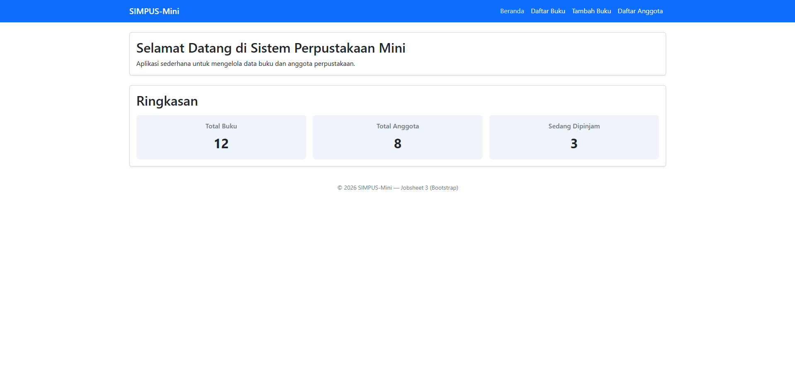
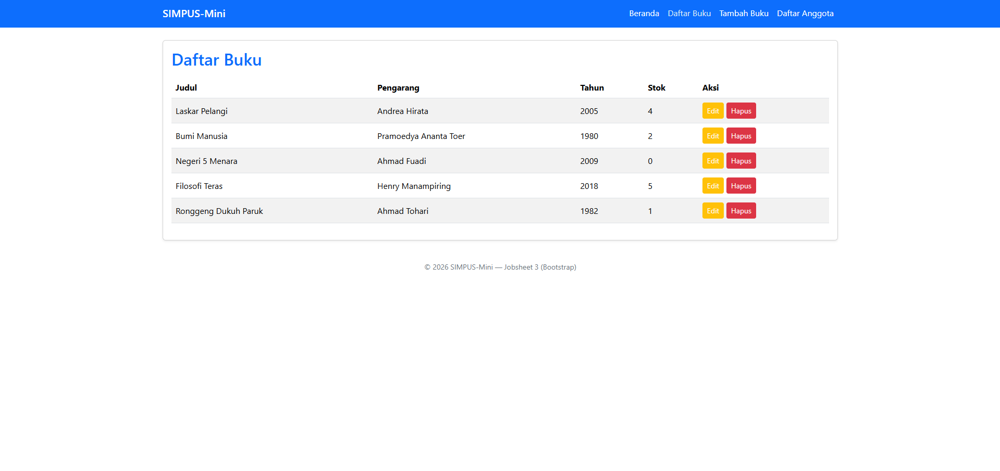
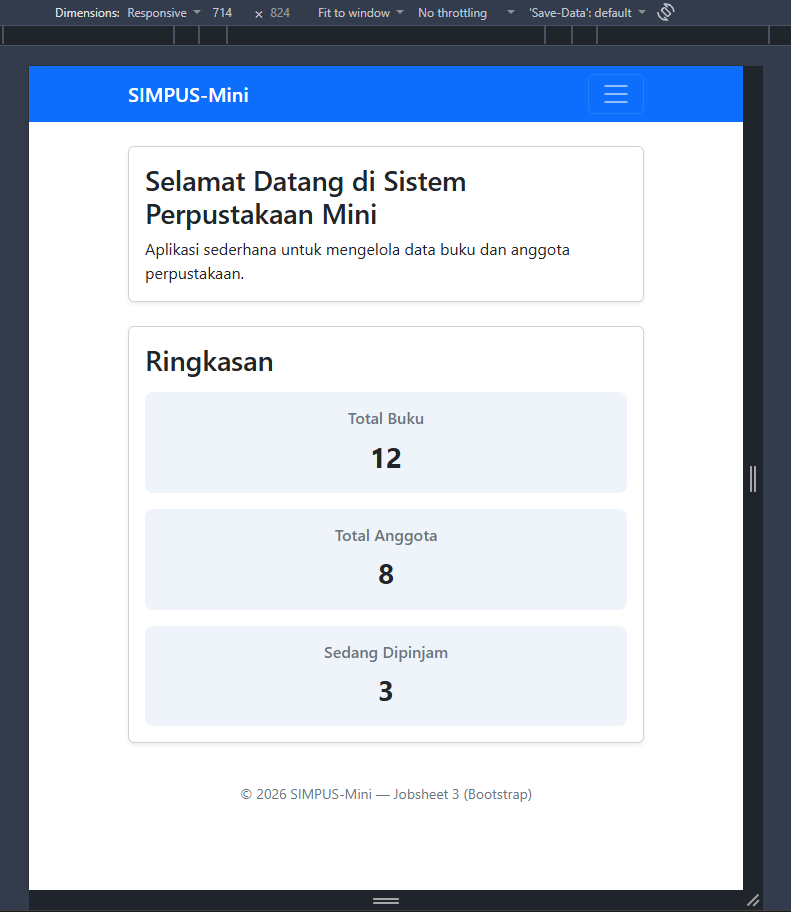
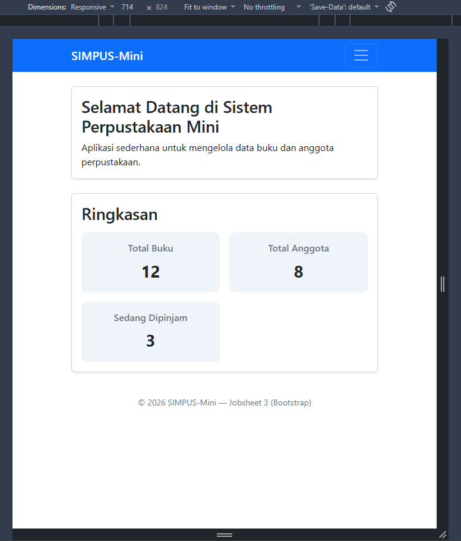
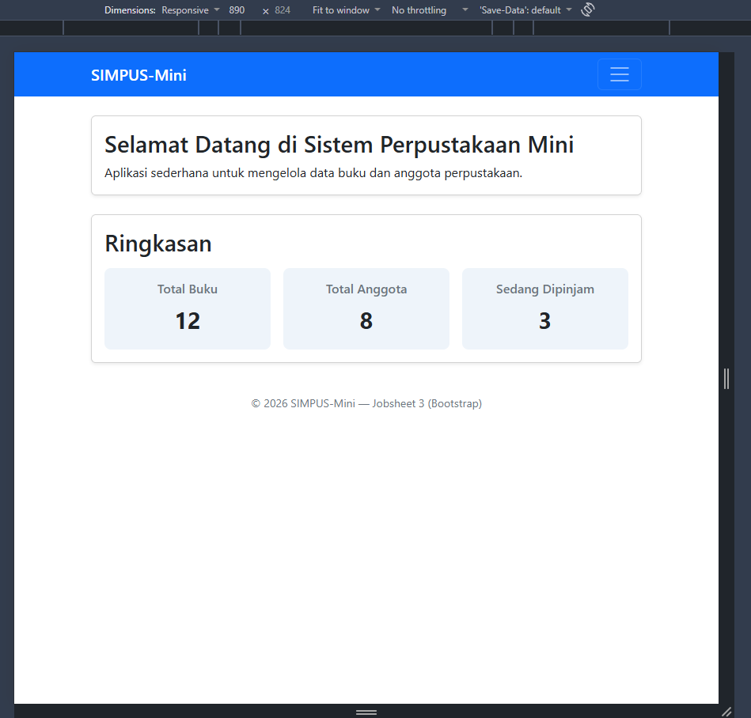
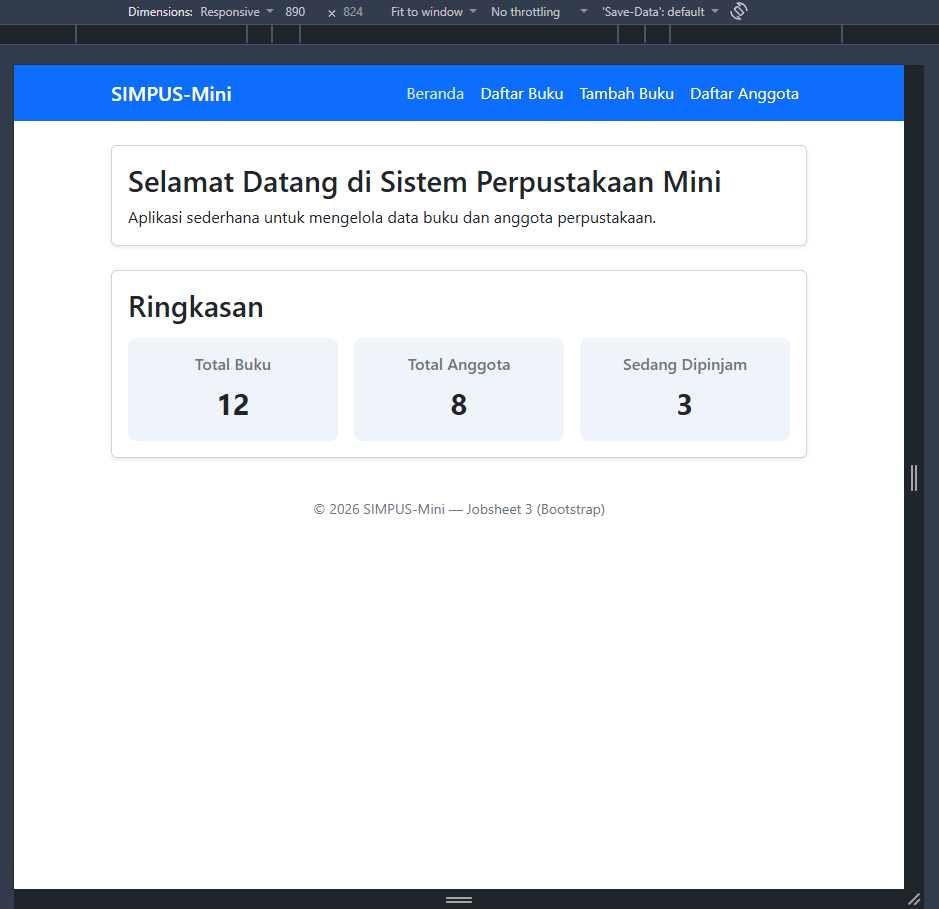
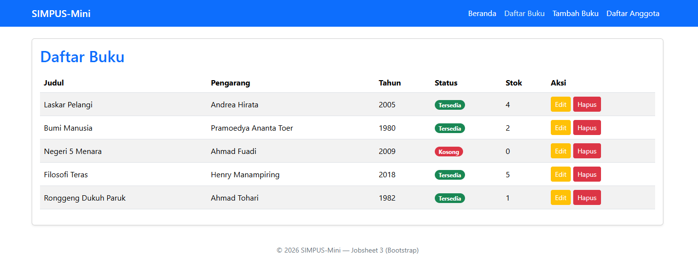

# JOBSHEET 3 - BOOTSTRAP

## LATIHAN TAMBAHAN

### 1. Mengganti warna brand ke tema bawaan Bootstrap

Mengganti `style="background-color:#1d5b8a;"` dan `style="color:#1d5b8a;` dengan class bawaan.

### 2. Menambahkan breakpoint ketiga di grid kartu statistik

Sebelum menambahkan breakpoint ketiga :

Setelah menambahkan breakpoint ketiga :

### 3. Mengganti breakpoint navbar

Sebelum diganti (masih .navbar-expand-lg) akan terlipat setelah lebar kurang dari 992 px :  

Setelah diganti (menjadi .navbar-expand-md), baru terlipat setelah lebar kurang dari 768 px :

### 4. Menambahkan komponen Bootstrap baru

Menambahkan komponen badges

### 5. Membandingkan ukuran file

Berdasarkan hasil inspeksi pada DevTools tab Network, perpindahan dari CSS murni ke framework Bootstrap menghasilkan peningkatan beban sumber daya (resource) sekitar 40 kali lipat.

<table>
    <thead>
        <tr>
            <td>Metrik DevTools</td>
            <td>Versi CSS Murni</td>
            <td>Versi Bootstrap (CDN)</td>
            <td>Selisih / Dampak</td>
        </tr>
    </thead>
    <tbody>
        <tr>
            <td><strong>Jumlah Request</strong></td>
            <td>3 requests</td>
            <td>5 requests</td>
            <td>Bertambah 2 request (file CSS dan JS Bootstrap)</td>
        </tr>
        <tr>
            <td><strong>Transferred Data</strong></td>
            <td>485 B</td>
            <td>3.8 kB</td>
            <td>Meningkat ~8 kali lipat</td>
        </tr>
        <tr>
            <td><strong>Total Resources</strong></td>
            <td><strong>8.0 kB</strong></td>
            <td><strong>318 kB</strong>></td>
            <td><strong>Meningkat ~40 kali lipat</strong></td>
        </tr>
        <tr>
            <td><strong>Finish Time</strong></td>
            <td>25 ms</td>
            <td>54 ms</td>
            <td>Waktu muat menjadi ~2 kali lebih lama</td>
        </tr>
        <tr>
            <td><strong>DOMContentLoaded</strong></td>
            <td>27 ms</td>
            <td>68 ms</td>
            <td>Waktu pemrosesan DOM melambat ~2,5 kali lipat</td>
        </tr>
    </tbody>
</table>

Kenapa Ukurannya Jauh Berbeda? (8.0 kB vs 318 kB)

- CSS Murni (8.0 kB) — Bawa Bekal Secukupnya:
  
  File style.css hanya berisi kode yang benar-benar kita tulis dan butuhkan sendiri untuk halaman tersebut. Tidak ada sebaris pun kode yang terbuang sia-sia (zero unused code), sehingga browser bisa mengunduhnya secara kilat.

- Bootstrap CDN (318 kB) — Bawa Satu Koper Perkakas Lengkap:
  
  Saat kita memanggil link CDN Bootstrap (bootstrap.min.css dan bootstrap.bundle.min.js), browser sebenarnya mengunduh seluruh ekosistem Bootstrap ke komputer. Walaupun di halaman SIMPUS-Mini kita hanya memakai navbar dan kotak ringkasan, Bootstrap tetap membawa ratusan fitur lainnya (seperti sistem grid 12 kolom, carousel foto, pop-up modal, hingga animasi). Akibatnya, ada banyak kode yang belum terpakai tetapi ikut terunduh.

Diskusi Untung-Rugi (Trade-off): Ukuran File vs Kecepatan Bikin Web

- Pakai CSS Murni
  
  Kelebihan: Halaman sangat ringan, hemat kuota internet, dan langsung terbuka instan meski diakses lewat koneksi lambat.
  
  Kekurangan: Pembuatannya memakan banyak waktu dan tenaga. Mulai dari warna, jarak spasi, tampilan tombol, hingga tata letak agar rapi saat dibuka di HP harus dipikirkan dan diketik manual satu per satu dari nol.

- Pakai Framework Bootstrap
  
  Kelebihan: Proses pembuatan web jauh lebih cepat dan praktis. Cukup pasang nama class bawaan, tampilan langsung rapi dan otomatis menyesuaikan layar (responsive). Cara ini juga memudahkan kerja kelompok karena penamaan kodenya sudah standar.
  
  Kekurangan: Ukuran file unduhan pertama menjadi lebih berat (bloated) untuk web sederhana yang fiturnya masih sedikit.

> Untuk web kecil seperti SIMPUS-Mini, CSS murni memang terasa jauh lebih unggul dan efisien karena halamannya masih sederhana. Namun, saat sistem nantinya berkembang menjadi aplikasi besar dengan puluhan tabel dan form data yang rumit, tambahan unduhan sekitar 300 kB menjadi kompromi yang sangat wajar demi menghemat waktu dan tenaga berhari-hari dalam mendesain tampilan.

