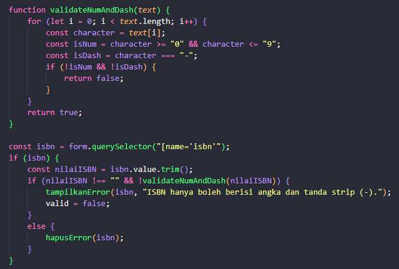
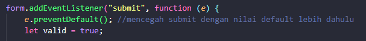
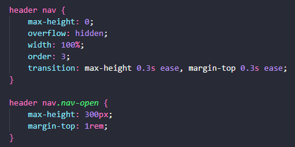
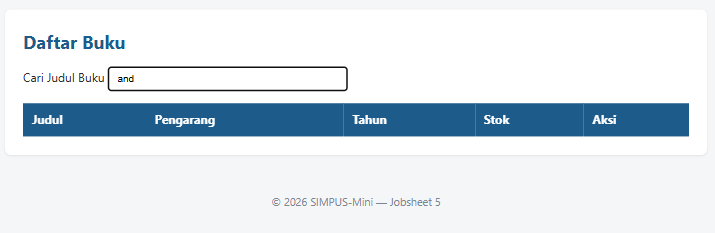
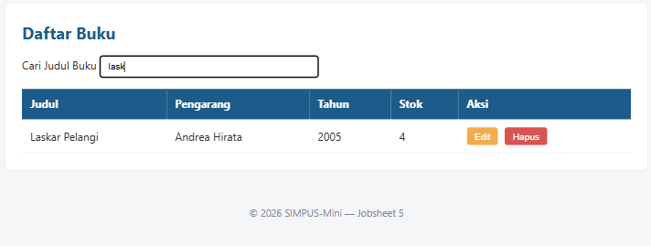
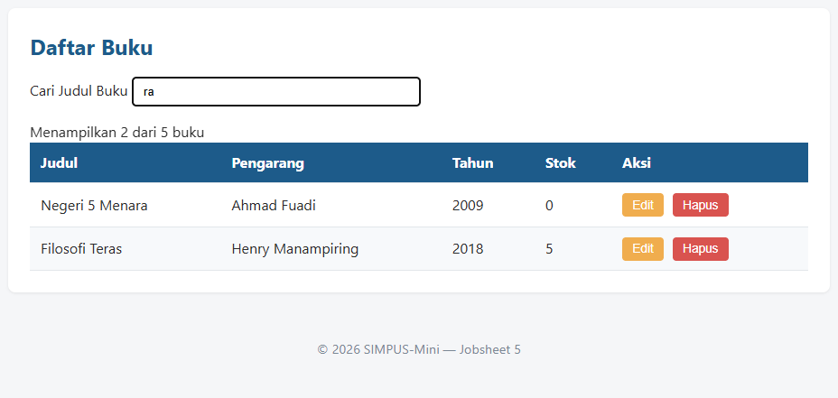
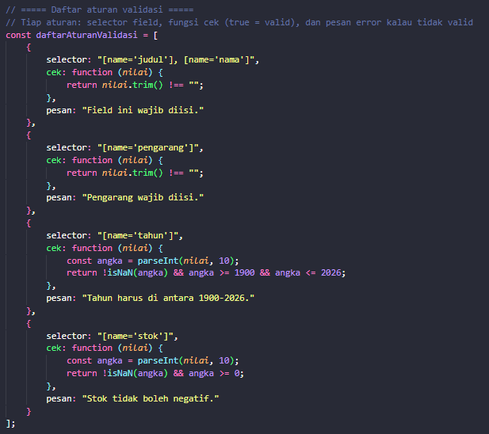

# JOBSHEET 5

## LATIHAN TAMBAHAN

### 1. Menambahkan validasi field baru

Validasi field ISBN hanya diperbolehkan input angka dan strip (-), serta 
mencegah input bernilai default sebelum submit.

### 2. Menambahkan animasi sederhana

### 3. Memperluas `initTableFilter`

Sebelum diubah :

Setelah diubah :

### 4. Menambah counter jumlah baris tersisa

Menambahkan function `updateCounter` untuk mendapatkan jumlah dari baris yang tersisa.

### 5. Refactor validasi

