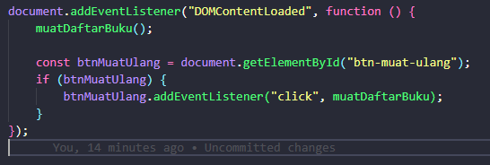
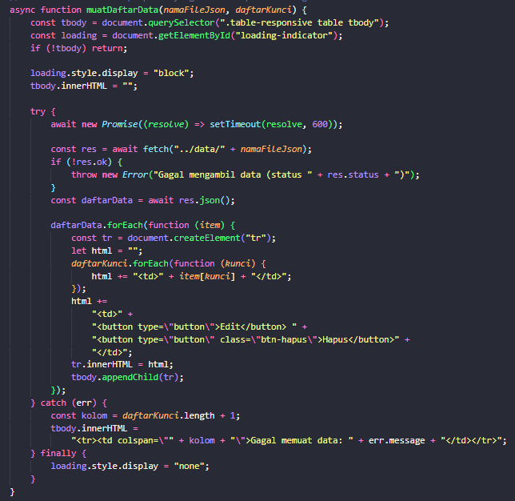
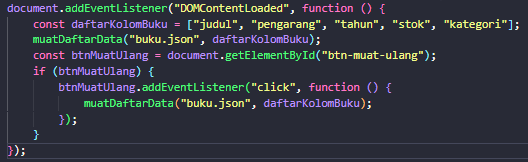
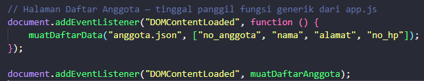
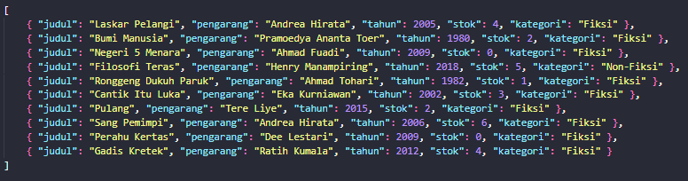
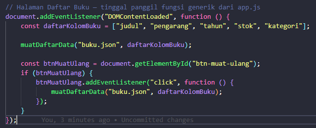
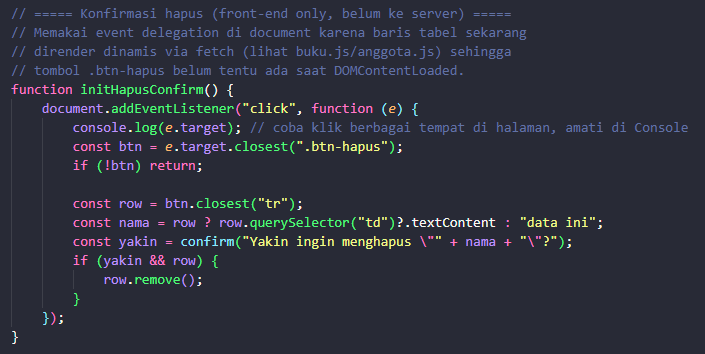
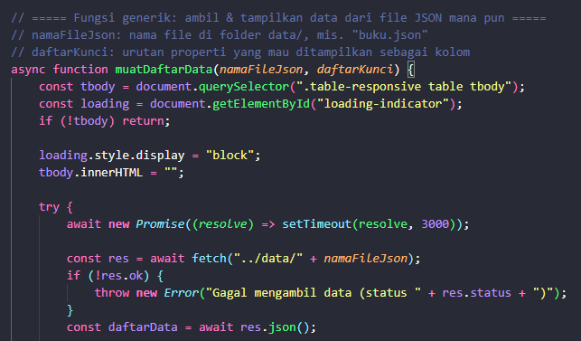

# JOBSHEET 6

## LATIHAN TAMBAHAN

### 1. Menambahkan tombol "Muat Ulang"

### 2. Menyatukan `buku.js` dan `anggota.js`

### 3. Menambahkan kolom baru di `data/buku.json`

### 4. Menguji delegasi event lebih jauh

### 5. Mengganti delay simulasi

