# JOBSHEET 07

## LATIHAN TAMBAHAN

### 1. Menambahkan validasi ISBN

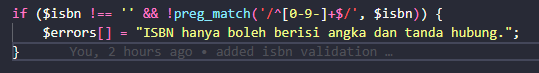

Hasilnya :

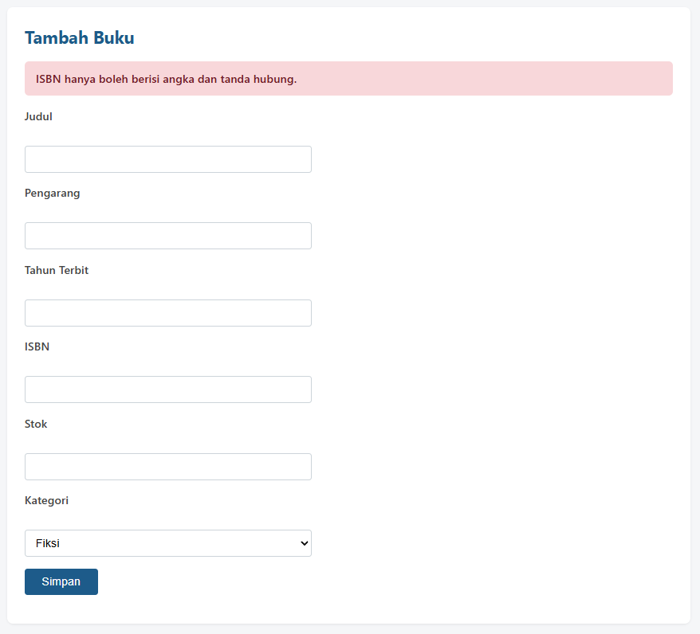

### 2. Menambahkan flash message

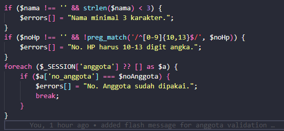

Hasilnya :

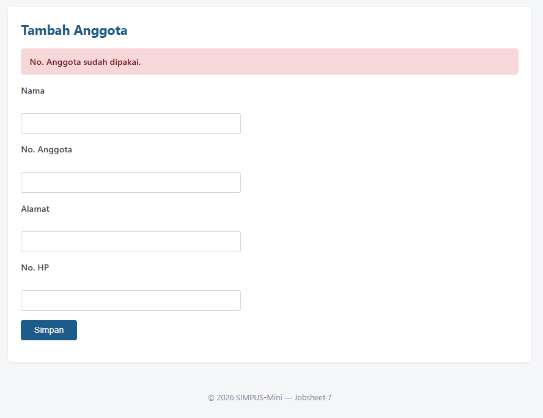

### 3. Membuat halaman `debug_session.php`

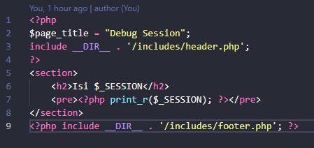

Hasilnya : 

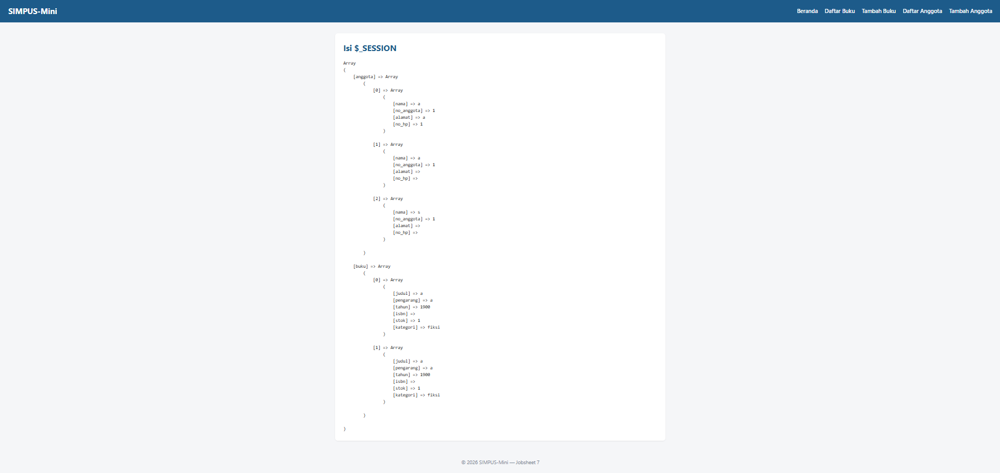

### 4. Menambahkan tombol "Reset Data"

Menambahkan `reset.php`

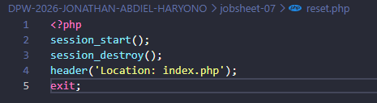

Menambahkan button di `index.php`

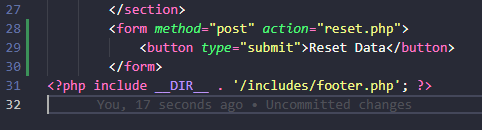

Sebelum di-reset :

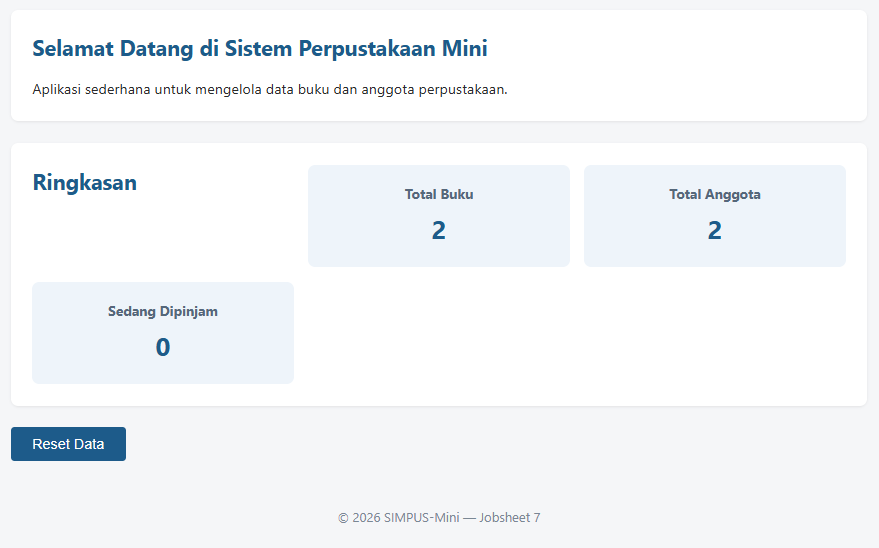

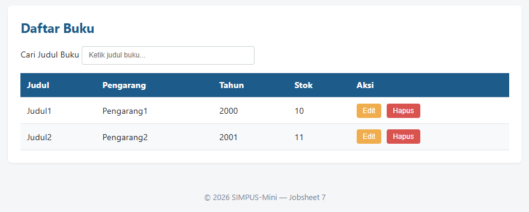

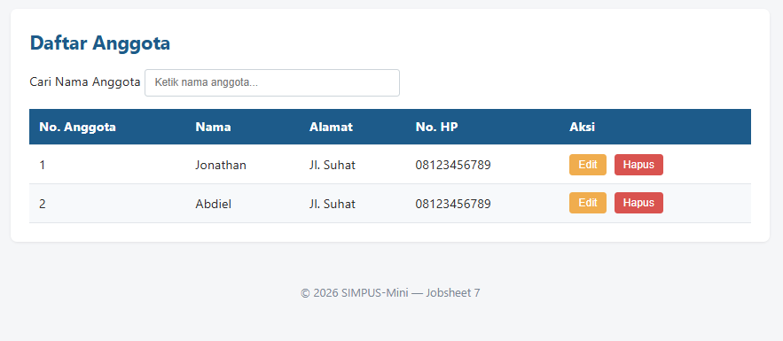

Setelah di-reset : 

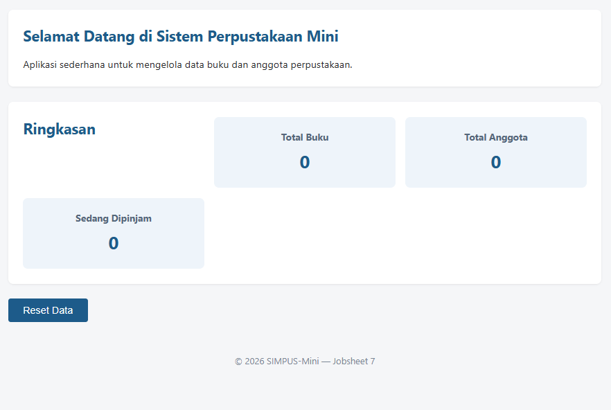

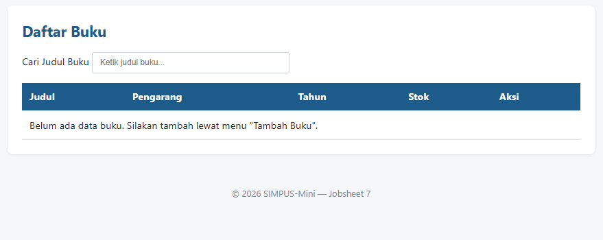

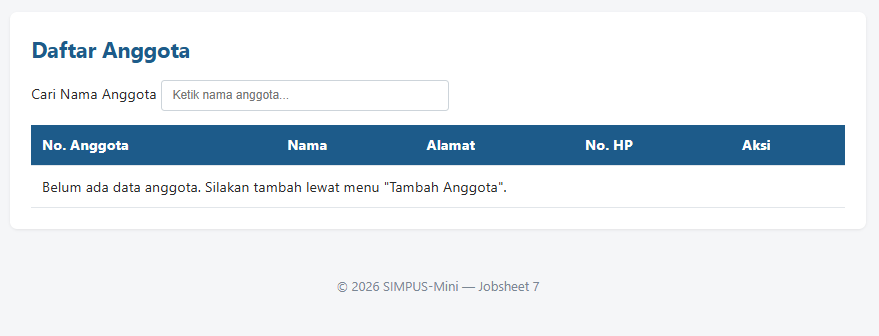
